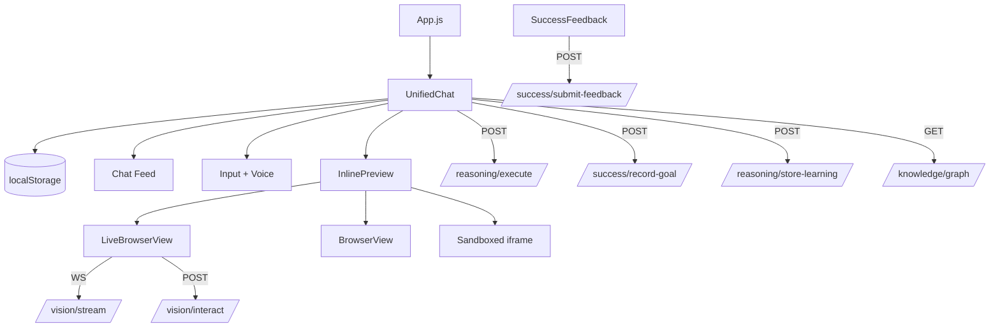

# Buddy UI Phase 7 Inspection Report

Generated: 2026-02-05
Scope: UI + chat interface + sandbox + embedded browser (read-only inspection)

## 1) UI Architecture

### Top-Level Structure
- App root: [frontend/src/App.js](frontend/src/App.js)
  - Renders `UnifiedChat` as the primary UI.

### Primary UI Components
- `UnifiedChat` (main UI shell)
  - Sessions list (localStorage-backed)
  - Chat message feed
  - Inline previews (generated code, browser view)
  - Knowledge graph modal toggle
  - Voice input (speech recognition)
  - Confidence display
  - Reasoning steps (todos)
  - Tool results panel
- `ChatInterface` (legacy/alternate chat UI, not mounted in App)
  - Simple chat + reasoning steps + confidence
- `SandboxWorkshop` (standalone sandbox UI, not mounted in App)
  - Workshop chat + simulated build preview
- `BrowserView` (snapshot view)
  - Screenshot + clickable overlay + onInteract callback
- `LiveBrowserView` (live stream)
  - WebSocket stream + click-to-interact
- `SuccessFeedback`
  - Feedback form for success tracking
- `AgentTodoList`
  - Standalone todo list for reasoning steps (not currently wired in App)

### Component Hierarchy (Current Active UI)
```
App
└── UnifiedChat
    ├── Session List / Sidebar
    ├── Chat Feed
    │   ├── Messages
    │   │   ├── Tool Results panel
    │   │   ├── Todos panel
    │   │   └── SuccessFeedback
    │   └── Inline Preview (optional)
    │       ├── LiveBrowserView (stream)
    │       ├── BrowserView (snapshot)
    │       └── Generated Preview (iframe)
    └── Input Bar + Voice Input
```

### Shared vs Isolated State
- Shared (within `UnifiedChat` only):
  - Sessions array, active session ID, messages
  - Confidence and reasoning steps for active session
  - Preview state (browser/sandbox/code)
- Isolated components:
  - `BrowserView` and `LiveBrowserView` are purely presentational; state is passed in as props
  - `SuccessFeedback` maintains internal feedback form state
  - `SandboxWorkshop` maintains its own state (standalone)

## 2) Data Flow

### Input → Backend
- `UnifiedChat` sends:
  - `POST /success/record-goal` (goal tracking)
  - `POST /reasoning/execute` (core reasoning loop)
  - `POST /reasoning/store-learning` (key findings/recommendations)
  - `POST /vision/interact` (live browser interaction from inline preview)
  - `GET /knowledge/graph?domain=_global` (knowledge graph display)

- `SandboxWorkshop` sends:
  - `POST /reasoning/execute` for code review/analysis prompt
  - Simulated build preview is local-only (no backend writes)

- `SuccessFeedback` sends:
  - `POST /success/submit-feedback`

### Backend → UI
- `UnifiedChat` consumes `reasoning/execute` results:
  - `message` (assistant response)
  - `reasoning_steps` (todos)
  - `confidence`
  - `tool_results`
  - `tools_used`
  - optional `generated_code`
- `LiveBrowserView` consumes WebSocket:
  - `ws://<host>:8000/vision/stream` with frames + clickables
- `BrowserView` consumes screenshot payload embedded in message preview

### Storage/State
- LocalStorage stores sessions and active session ID
- No persistent UI state beyond localStorage

## 3) Execution Coupling

### UI Triggers Actions
- `UnifiedChat` calls backend reasoning execution (active tool and workflow initiation)
- `LiveBrowserView` sends click events to `/vision/interact`
- `SuccessFeedback` writes feedback to backend
- Knowledge graph fetch is read-only

### Dispatch/Workflow Modification
- No UI capability to dispatch Phase 6 scheduler tasks directly
- No UI to construct/modify workflows or dependency graphs
- No UI for queue persistence/restart control

## 4) Phase Alignment

### Phase Mapping
| UI Feature | Phase Alignment | Status |
|---|---|---|
| Reasoning steps (todos) in chat | Phase 4 (multi-step observation) | Present (in UnifiedChat, ChatInterface) |
| Tool results list in chat | Phase 5 (tool execution visibility) | Present |
| Live browser view (stream + interact) | Phase 5 (Vision/Arms visibility) | Present |
| Snapshot browser view with clickables | Phase 5 (Vision inspection) | Present |
| Confidence display | Phase 2 (graded confidence) | Present |
| Feedback panel | Phase 2/learning loop | Present |
| Scheduler queue visibility | Phase 6 | Missing |
| Task dependency graph | Phase 6 | Missing |
| Workflow editor / graph | Phase 7 | Missing |
| Workflow playback / branching view | Phase 7 | Missing |
| Recovery visualization | Phase 7 | Missing |

### Phase 7 Readiness
- **Qualifies as Phase 7 (partial):**
  - Inline previews of live browser and generated artifacts show “execution visualization”
  - Chat-based interaction + tool results forms a basic execution transcript
- **Partially qualifies:**
  - Reasoning steps (todos) show step-by-step progression but lack a DAG/graph view
- **Missing:**
  - Visual workflow editor
  - DAG visualization for task dependencies
  - Scheduler queue inspection and replay
  - Branching visualization and timeline
  - Recovery workflows view

## 5) Safety Assessment

### Read-Only Compliance
- UI is **not fully read-only**:
  - `/reasoning/execute` actively triggers tool execution
  - `/vision/interact` can trigger interactions on live browser
  - `/success/submit-feedback` writes feedback

### Risk Notes
- Live Browser interactions represent real action execution path (Phase 5 Arms)
- Generated HTML previews run in sandboxed iframe, but are still active content
- No explicit UI guardrails for high-risk actions; relies on backend safeguards

## Architecture Diagram (Mermaid)



## Recommendations

### Keep as-is
- Chat transcript + reasoning steps (Phase 4 visibility)
- Tool result rendering (Phase 5 visibility)
- Live browser view and snapshot browser view components

### Refactor later
- Consolidate duplicate chat implementations (`UnifiedChat` vs `ChatInterface` vs `SandboxWorkshop`)
- Unify reasoning/todo panel into a single shared component
- Clarify localStorage session model vs backend sessions

### Extend for Phase 7
- Add task scheduler panel (queue depth, active tasks, statuses)
- Add DAG visualization for dependencies and branching
- Add recovery checkpoint panel (queue state file + restored tasks)
- Add timeline view for task execution and retries
- Add explicit safety gating UI for high-risk actions

## Summary

Phase 7 is **not implemented**, but UI already provides:
- A reliable transcript of reasoning and tool execution (Phase 4/5)
- Visual feedback for browser automation (Phase 5)

Missing components for Phase 7 readiness:
- Workflow graph editor
- Queue inspection and replay
- Branch visualization
- Recovery and persistence UI
- Scheduler health visualization
