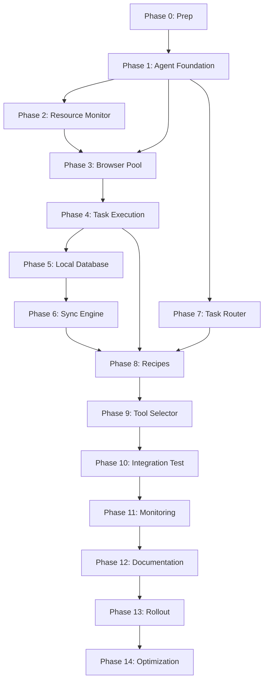

# 🗺️ Buddy Local Agent - Visual Roadmap

## 🎯 The Big Picture

```
┌─────────────────────────────────────────────────────────┐
│  CURRENT STATE: 100% Cloud                              │
│  Cost: $185-320/month                                   │
│  Capability: Limited by API availability               │
└─────────────────────────────────────────────────────────┘
                          ↓
┌─────────────────────────────────────────────────────────┐
│  TARGET STATE: 90% Local + 10% Cloud                    │
│  Cost: $18-35/month (90% savings!)                      │
│  Capability: Universal (web nav for everything)         │
└─────────────────────────────────────────────────────────┘
```

---

## 📦 Component Dependencies



---

## 🏗️ Build Order (Dependency-Based)

### **FOUNDATION LAYER** (Build First)
```
┌─────────────┐
│  Phase 0    │  Prep & Planning
│  Phase 1    │  Agent Foundation
│  Phase 2    │  Resource Monitor
└─────────────┘
        ↓
Dependencies: None
Can build in parallel: None
Timeline: Week 1
```

### **EXECUTION LAYER** (Build Second)
```
┌─────────────┐
│  Phase 3    │  Browser Pool Manager
│  Phase 4    │  Task Execution Engine
└─────────────┘
        ↓
Dependencies: Foundation Layer complete
Can build in parallel: Phase 3 & 4 partially
Timeline: Weeks 2-3
```

### **DATA LAYER** (Build Third)
```
┌─────────────┐
│  Phase 5    │  Local Database
│  Phase 6    │  Sync Engine
└─────────────┘
        ↓
Dependencies: Execution Layer complete
Can build in parallel: Phase 5 first, then 6
Timeline: Week 4
```

### **INTELLIGENCE LAYER** (Build Fourth)
```
┌─────────────┐
│  Phase 7    │  Task Router (Cloud)
│  Phase 8    │  Recipe System
│  Phase 9    │  Tool Selector Update
└─────────────┘
        ↓
Dependencies: Data Layer complete
Can build in parallel: All 3 can overlap
Timeline: Weeks 5-6
```

### **PRODUCTION LAYER** (Build Last)
```
┌─────────────┐
│  Phase 10   │  Integration Testing
│  Phase 11   │  Monitoring Dashboard
│  Phase 12   │  Documentation
│  Phase 13   │  Production Rollout
│  Phase 14   │  Optimization
└─────────────┘
        ↓
Dependencies: Intelligence Layer complete
Can build in parallel: 11 & 12 can overlap
Timeline: Weeks 7-8
```

---

## 🎯 Critical Path (Must Complete in Order)

```
Phase 0 → Phase 1 → Phase 4 → Phase 5 → Phase 6 → Phase 10 → Phase 13

This is the MINIMUM viable path to production.
All other phases enhance but aren't blocking.
```

---

## ⚡ Quick Win Phases (High Impact, Fast Build)

### **1. Phase 1: Agent Foundation** (3-4 days)
- **Impact:** Can communicate with Firebase
- **Complexity:** Low
- **Blockers:** None
- **Quick Win:** See agent polling tasks within 1 day

### **2. Phase 3: Browser Pool** (5-7 days)
- **Impact:** Can run 20+ browsers
- **Complexity:** Medium
- **Blockers:** Phase 1
- **Quick Win:** Test with 10 browsers by day 3

### **3. Phase 8: Recipe System** (5-7 days)
- **Impact:** Pre-built workflows (huge time saver)
- **Complexity:** Low-Medium
- **Blockers:** Phase 4
- **Quick Win:** First recipe working in 2 days

### **4. Phase 11: Monitoring** (3-4 days)
- **Impact:** Beautiful dashboard showing everything
- **Complexity:** Low
- **Blockers:** Phase 1
- **Quick Win:** Basic dashboard in 1 day

---

## 🔥 Fast Track: MVP in 2 Weeks

If you want to get something working FAST, do this:

### **Week 1: Core Agent**
```
✅ Phase 0: Prep (1 day)
✅ Phase 1: Foundation (3 days)  
✅ Phase 3: Browser Pool (3 days)
```

### **Week 2: Make It Work**
```
✅ Phase 4: Task Execution (4 days)
✅ Phase 6: Basic Sync (2 days)
✅ Phase 10: Smoke Test (1 day)
```

**Result:** You'll have a working local agent executing tasks!  
**Savings:** 50%+ cost reduction immediately  
**Limitation:** No recipes, no monitoring, no polish

---

## 📊 Phase Complexity Matrix

```
┌─────────────────┬───────────┬────────────┬──────────┐
│ Phase           │ Days      │ Complexity │ Risk     │
├─────────────────┼───────────┼────────────┼──────────┤
│ 0: Prep         │ 1-2       │ ⭐         │ Low      │
│ 1: Foundation   │ 3-4       │ ⭐⭐       │ Low      │
│ 2: Monitor      │ 2-3       │ ⭐⭐       │ Low      │
│ 3: Browser Pool │ 5-7       │ ⭐⭐⭐     │ Medium   │
│ 4: Execution    │ 5-7       │ ⭐⭐⭐     │ Medium   │
│ 5: Database     │ 3-4       │ ⭐⭐       │ Low      │
│ 6: Sync         │ 5-7       │ ⭐⭐⭐⭐   │ High     │
│ 7: Router       │ 3-4       │ ⭐⭐       │ Low      │
│ 8: Recipes      │ 5-7       │ ⭐⭐       │ Low      │
│ 9: Tool Select  │ 2-3       │ ⭐⭐       │ Medium   │
│ 10: Integration │ 5-7       │ ⭐⭐⭐⭐   │ High     │
│ 11: Monitoring  │ 3-4       │ ⭐⭐       │ Low      │
│ 12: Docs        │ 2-3       │ ⭐         │ Low      │
│ 13: Rollout     │ 7-14      │ ⭐⭐⭐     │ High     │
│ 14: Optimize    │ Ongoing   │ ⭐⭐       │ Low      │
└─────────────────┴───────────┴────────────┴──────────┘

TOTAL: 54-75 days (8-11 weeks)
REALISTIC: 45-55 days part-time (6-8 weeks)
AGGRESSIVE: 21-28 days full-time (3-4 weeks)
```

---

## 🎢 Risk Heat Map

```
          LOW COMPLEXITY              HIGH COMPLEXITY
       │                          │
HIGH   │  Phase 8: Recipes        │  Phase 4: Execution
IMPACT │  Phase 11: Monitoring    │  Phase 3: Browser Pool
       │  Phase 7: Router         │  Phase 6: Sync Engine
       │                          │  Phase 10: Integration
       ├──────────────────────────┼─────────────────────
LOW    │  Phase 0: Prep           │  Phase 13: Rollout
IMPACT │  Phase 1: Foundation     │  
       │  Phase 2: Monitor        │
       │  Phase 5: Database       │
       │  Phase 9: Tool Selector  │
       │  Phase 12: Docs          │
```

**Strategy:** 
- Tackle high-impact/low-complexity first (quick wins)
- Then high-impact/high-complexity (hard but necessary)
- Save low-impact for polish phase

---

## 💡 Parallel Development Opportunities

You can build these in parallel to speed up development:

### **Week 1-2:**
```
Developer 1: Phase 1 (Foundation)
Developer 2: Phase 0 (Prep) + Phase 12 (Start docs)
```

### **Week 3-4:**
```
Developer 1: Phase 3 (Browser Pool)
Developer 2: Phase 2 (Monitor) → Phase 11 (Dashboard)
```

### **Week 5:**
```
Developer 1: Phase 4 (Execution)
Developer 2: Phase 5 (Database) → Phase 8 (Recipes)
```

### **Week 6:**
```
Developer 1: Phase 6 (Sync)
Developer 2: Phase 7 (Router) + Phase 9 (Tool Selector)
```

### **Week 7-8:**
```
Both: Phase 10 (Integration) → Phase 13 (Rollout)
```

**Solo development:** Just follow the order linearly 😊

---

## 🔄 Iterative Development Strategy

Instead of building everything perfect first time:

### **Iteration 1: Skeleton (Week 1)**
- Basic agent that can start/stop
- Connects to Firebase
- Prints "task received"
- **Goal:** Prove communication works

### **Iteration 2: Single Browser (Week 2)**
- Launch 1 Chrome browser
- Navigate to URL
- Extract data
- Return result
- **Goal:** Prove execution works

### **Iteration 3: Multiple Browsers (Week 3)**
- Launch 5 browsers
- Run 5 tasks in parallel
- Basic resource monitoring
- **Goal:** Prove parallelization works

### **Iteration 4: Production Ready (Weeks 4-6)**
- Add all features
- Handle errors
- Optimize performance
- **Goal:** Actually usable

### **Iteration 5: Polish (Weeks 7-8)**
- Monitoring dashboards
- Documentation
- Recipes
- **Goal:** Delightful to use

---

## 📈 Complexity Reduction Strategies

### **Strategy 1: Start Simple**
```
❌ DON'T: Build 20-browser pool on day 1
✅ DO: Start with 1 browser, then scale

❌ DON'T: Build complex sync with conflicts
✅ DO: Simple sync first, add features later

❌ DON'T: Perfect error handling everywhere
✅ DO: Happy path first, errors later
```

### **Strategy 2: Use Existing Code**
```
✅ WebNavigatorAgent already exists (619 lines)
✅ Firebase clients already exist
✅ Tool registry already exists
✅ Multi-step planner already exists

Just integrate, don't rebuild!
```

### **Strategy 3: Progressive Enhancement**
```
Version 0.1: Works on your machine
Version 0.5: Works reliably
Version 1.0: Production ready
Version 1.5: Polished and optimized
```

---

## 🎯 Success Checkpoints

### **After Phase 1:**
```bash
python buddy_local_agent.py --start
# Output: ✅ "Agent started, connected to Firebase"
```

### **After Phase 3:**
```python
pool = BrowserPoolManager(max_browsers=10)
pool.start()
# Output: ✅ "10 browsers ready"
```

### **After Phase 4:**
```
Task: "Google search for Python tutorials"
# Output: ✅ Returns 10 results in 3 seconds
```

### **After Phase 6:**
```
Sync 100 results to Firebase
# Output: ✅ "Synced in 12 seconds, 0 errors"
```

### **After Phase 10:**
```
Full mission: "Find 20 HR managers and save to GHL"
# Output: ✅ All 20 added, 4 minutes total, $0 cost
```

### **After Phase 13:**
```
1 week of production use
# Output: ✅ $127 saved, 99.2% uptime, 847 tasks completed
```

---

## 🚀 Launch Checklist

Before calling it "done":

### **Functionality:**
- [ ] Agent starts/stops cleanly
- [ ] Executes tasks successfully
- [ ] Syncs results to Firebase
- [ ] Falls back to cloud when offline
- [ ] Handles errors gracefully
- [ ] Recovers from crashes
- [ ] Scales to 20+ browsers
- [ ] Respects resource limits

### **Reliability:**
- [ ] Runs for 24 hours without issues
- [ ] Survives laptop sleep/wake
- [ ] Handles network interruptions
- [ ] No memory leaks (48-hour test)
- [ ] Auto-restarts on crash

### **Usability:**
- [ ] Install in < 10 minutes
- [ ] Start with single command
- [ ] Dashboard shows status
- [ ] Logs are readable
- [ ] Alerts work

### **Performance:**
- [ ] Task latency < 5 seconds
- [ ] Sync latency < 60 seconds
- [ ] 95%+ success rate
- [ ] Saves 80%+ on costs

### **Documentation:**
- [ ] Installation guide complete
- [ ] Quick start guide tested
- [ ] Troubleshooting covers common issues
- [ ] Code is commented
- [ ] Architecture documented

---

## 💰 ROI Timeline

```
Investment:
- Development time: 6-8 weeks part-time
- Learning curve: 1-2 weeks
- Testing/debugging: 1 week
Total: ~10 weeks of effort

Returns:
- Month 1: Save $150 (payback 15 hours of work)
- Month 2: Save $250 (payback 25 hours)
- Month 3+: Save $270/month ($3,240/year)

Break-even: After 2-3 months
Lifetime value: INFINITE (keeps saving forever)

Your hourly rate for building this: $324/year per week invested
If it takes 10 weeks: $32.40/hour saved EVERY MONTH FOREVER
```

**In other words:** This pays for itself in 2-3 months, then it's pure savings forever! 🚀

---

## 🎁 Bonus Benefits (Beyond Cost Savings)

1. **No API Limitations:** Web nav can do ANYTHING
2. **No Rate Limits:** Your browser, your rules
3. **Learning System:** Gets better over time
4. **Instant Execution:** No cold starts (browsers warm)
5. **Debugging:** Can watch browser in action
6. **Privacy:** Sensitive tasks stay local
7. **Parallelization:** 20-30 tasks simultaneously
8. **Future Proof:** Works even if APIs change

---

## 🤔 FAQ

### **Q: What if my laptop is off?**
**A:** Cloud fallback handles it automatically. User might see "Will process when local agent available" for non-urgent tasks.

### **Q: Can I use my laptop while Buddy runs?**
**A:** YES! With resource monitoring, it only uses 70-80% of resources, leaving plenty for you.

### **Q: What if it crashes?**
**A:** Auto-restart + SQLite buffer means zero data loss. It'll resume exactly where it stopped.

### **Q: Can I run this on a VM?**
**A:** Yes! Any Windows/Mac/Linux with 8+ GB RAM works.

### **Q: What about updates?**
**A:** Simple: `git pull`, restart agent. Takes 30 seconds.

### **Q: How much maintenance?**
**A:** Near zero with monitoring. Check dashboard once/week, update monthly.

---

## 🎬 Ready to Start?

Pick your timeline:

### **Option 1: Relaxed (8 weeks, 10-15 hours/week)**
- ✅ Low stress
- ✅ Thorough testing
- ✅ Best quality
- ⏰ Live in 2 months

### **Option 2: Balanced (6 weeks, 20 hours/week)**
- ✅ Good balance
- ✅ Reasonable pace
- ✅ High quality
- ⏰ Live in 1.5 months

### **Option 3: Sprint (4 weeks, 40 hours/week)**
- ✅ Fast results
- ⚠️ Intense work
- ⚠️ Need to be careful
- ⏰ Live in 1 month

**My recommendation:** Option 2 (Balanced) - 6 weeks, 20 hours/week

You'll have a polished, production-ready system with time to test properly.

---

**Let me know which option works for you, and I'll start implementing!** 🚀

---

**Document Version:** 1.0  
**Created:** February 11, 2026  
**Companions:** LOCAL_AGENT_MASTER_PLAN.md (detailed tasks)
