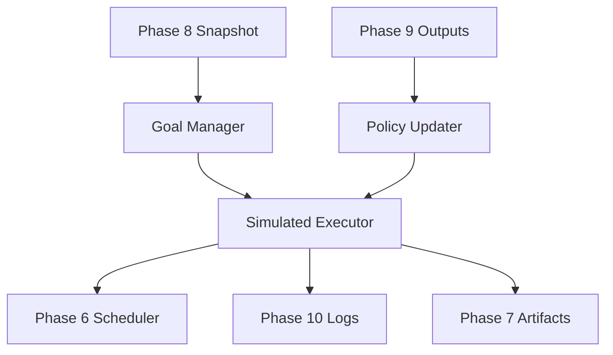

# Phase 10 Architecture — Autonomous Adaptation

Generated: 2026-02-05

## Overview
Phase 10 adds an autonomous adaptation layer that uses prior learning outputs (Phase 9) to plan, simulate, and adjust workflows in sandboxed wave mode. The design is additive and does **not** modify any Phase 1–9 logic.

## Modules
- buddy_adaptive_harness.py
  - Orchestrates wave-based simulations
  - Integrates policy updates, goals, and simulated execution
  - Writes all outputs to outputs/phase10

- buddy_goal_manager.py
  - Generates high-level goals and task sequences
  - Uses Phase 8 snapshots when available
  - Adds progressive complexity by wave

- buddy_policy_updater.py
  - Updates thresholds, retry strategies, and priority bias
  - Driven by outcomes and confidence signals

- buddy_simulated_executor.py
  - Executes tasks in dry-run via Phase 6 scheduler
  - Applies safety gates and self-questions
  - Captures confidence updates and observability snapshots

## Execution Loop (Wave Mode)
1. Load Phase 9 outcomes (if present)
2. Generate goals and candidate tasks (Phase 8 snapshots preferred)
3. Execute tasks in dry-run with high-risk deferrals ($\ge 0.8$ threshold)
4. Generate self-questions and confidence updates
5. Update adaptive policy per wave
6. Persist logs and wave metrics

## Safety & Observability
- High-risk tasks are deferred unless confidence $\ge 0.8$
- No real web actions are dispatched
- Observability snapshots are captured from:
  - outputs/task_scheduler_metrics/queue_state.json
  - outputs/task_scheduler_metrics/task_execution_log.jsonl

## Outputs
- outputs/phase10/self_questions.jsonl
- outputs/phase10/task_outcomes.jsonl
- outputs/phase10/confidence_updates.jsonl
- outputs/phase10/policy_updates.jsonl
- outputs/phase10/phase10_ui_state.json
- outputs/phase10/PHASE_10_READINESS_REPORT.md

## Architecture Diagram (Mermaid)

