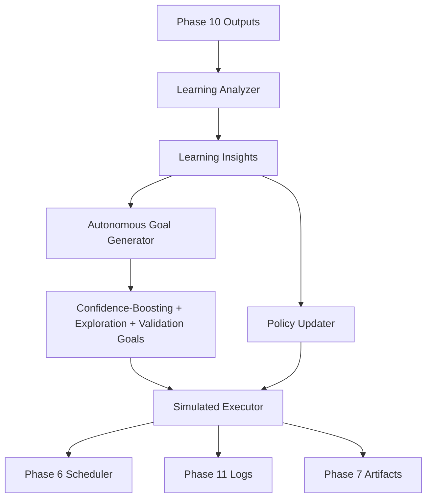

# Phase 11 Architecture — Self-Driven Learning

Generated: 2026-02-05

## Overview
Phase 11 introduces autonomous learning capabilities that ingest Phase 10 outputs, analyze patterns, generate adaptive goals, and simulate new strategies. The design is additive and does **not** modify any Phase 1–10 logic.

## Modules
- buddy_self_driven_harness.py
  - Orchestrates autonomous learning loop
  - Integrates analyzer, goal generator, policy updater, and executor
  - Writes all outputs to outputs/phase11

- buddy_learning_analyzer.py
  - Analyzes Phase 10 task outcomes and confidence updates
  - Identifies patterns: misalignments, deferred tasks, success rates
  - Generates learning insights with recommendations

- buddy_autonomous_goal_generator.py
  - Generates new workflow goals based on learning insights
  - Creates confidence-boosting, exploration, and validation workflows
  - Autonomously adapts task sequences

- buddy_policy_updater.py (reused from Phase 10)
  - Updates thresholds, retry strategies, and priority bias
  - Driven by observed outcomes and learning insights

- buddy_simulated_executor.py (reused from Phase 10)
  - Executes tasks in dry-run via Phase 6 scheduler
  - Applies safety gates and self-questions
  - Captures confidence updates and observability snapshots

## Execution Loop (Self-Driven)
1. Load Phase 10 outputs (task_outcomes.jsonl, confidence_updates.jsonl, policy_updates.jsonl)
2. Analyze outcomes for patterns:
   - Confidence misalignment (over/under-confident tasks)
   - Deferred high-risk tasks
   - Success patterns by risk level
   - Policy effectiveness
3. Generate learning insights with recommendations
4. Generate autonomous goals per wave:
   - Confidence-boosting workflows (precursor tasks for deferred high-risk)
   - Exploration workflows (test policy boundaries)
   - Validation workflows (recalibrate confidence)
5. Execute tasks in dry-run with high-risk deferrals ($\ge 0.8$ threshold)
6. Generate self-questions and confidence updates
7. Update adaptive policy per wave
8. Persist logs and wave metrics

## Learning Insights
Phase 11 identifies the following insight types:
- **confidence_misalignment:** Tasks where predicted confidence mismatched outcome
- **deferred_high_risk:** High-risk tasks deferred due to low confidence
- **high_success_risk_level:** Risk levels with consistently high success rates
- **policy_stabilization:** Policy has reached steady state

Each insight includes:
- Description
- Confidence score
- Supporting evidence
- Recommendation for next steps

## Autonomous Goal Generation
Goals are generated based on insights:
1. **Confidence-Boosting Goals**
   - Created for each deferred high-risk task
   - Includes precursor tasks (inspect, extract) to build confidence
   - Elevated task added with increased confidence

2. **Exploration Goals**
   - Generated when success rates are high
   - Tests policy boundaries with new workflow patterns

3. **Validation Goals**
   - Generated when confidence misalignment detected
   - Includes low/high confidence tasks to recalibrate

## Safety & Observability
- High-risk tasks are deferred unless confidence $\ge 0.8$
- No real web actions are dispatched
- Observability snapshots are captured from:
  - outputs/task_scheduler_metrics/queue_state.json
  - outputs/task_scheduler_metrics/task_execution_log.jsonl

## Outputs
- outputs/phase11/self_questions.jsonl
- outputs/phase11/task_outcomes.jsonl
- outputs/phase11/confidence_updates.jsonl
- outputs/phase11/policy_updates.jsonl
- outputs/phase11/learning_insights.jsonl
- outputs/phase11/phase11_ui_state.json

## Architecture Diagram (Mermaid)

