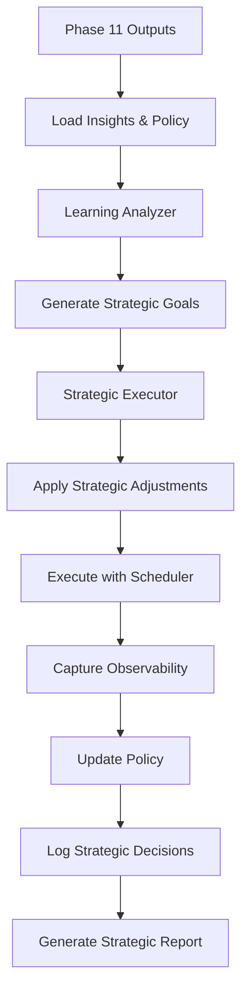

# Phase 12 Architecture — Autonomous Strategic Execution

Generated: 2026-02-05

## Overview
Phase 12 introduces strategic decision-making capabilities that ingest Phase 11 learning insights and apply adaptive reasoning during workflow execution. The system can elevate confidence for tasks matching successful patterns, choose alternate paths, and dynamically adjust policies. All operations remain in dry-run mode with safety gates enforced.

## Modules

### buddy_strategic_executor.py
- Extends SimulatedExecutor with strategic decision-making
- Applies confidence elevation based on learning insights
- Boosts confidence for tasks in proven successful risk categories
- Logs decision rationale for audit and review

**Key Methods:**
- `_apply_strategic_adjustments()`: Analyzes insights and adjusts task confidence
- `execute_wave()`: Executes tasks with strategic pre-processing
- `get_strategic_summary()`: Returns decision metrics for reporting

### buddy_strategic_harness.py
- Orchestrates Phase 12 strategic execution
- Loads Phase 11 learning insights and policy state
- Generates strategic goals using AutonomousGoalGenerator
- Executes waves with StrategicExecutor
- Produces comprehensive strategic execution report

**Key Methods:**
- `_load_phase11_policy()`: Inherits final policy from Phase 11
- `_load_phase11_insights()`: Loads learning insights for strategic decisions
- `run()`: Executes multi-wave strategic workflow
- `_write_report()`: Generates PHASE_12_STRATEGIC_REPORT.md

## Strategic Decision Types

### 1. Confidence Elevation
Applied to high-risk tasks that match deferred patterns from Phase 11:
- **Trigger:** High-risk task with confidence < 0.8 AND high-confidence insight about deferred patterns
- **Action:** Boost confidence by +0.15 (max 0.85)
- **Rationale:** Learning from Phase 11 indicates these tasks are safe with proper precursors

### 2. Pattern Boost
Applied to tasks in risk categories with proven 100% success rates:
- **Trigger:** Task risk level matches high-success insight from Phase 11
- **Action:** Boost confidence by +0.05
- **Rationale:** Historical success in this risk category warrants confidence boost

### 3. Alternate Path Selection (Future)
- Choose different workflow branches based on deferred task analysis
- Test alternate strategies when primary path blocked

### 4. Priority Boost (Future)
- Elevate priority for high-value tasks based on learning insights
- Optimize execution order for strategic outcomes

## Execution Flow



## Strategic Adjustment Logic

For each task before execution:
1. Check task risk level and confidence
2. Query learning insights index by type
3. **If HIGH risk and low confidence:**
   - Check for `deferred_high_risk` insights
   - If high-confidence insight exists (≥0.9), elevate confidence by +0.15
   - Log `confidence_elevation` decision with rationale
4. **If risk level has proven success:**
   - Check for `high_success_risk_level` insights matching risk level
   - If 100% success rate documented, boost confidence by +0.05
   - Log `pattern_boost` decision with rationale
5. Apply adjusted confidence to task
6. Execute via Phase 6 scheduler

## Safety & Observability
- High-risk tasks still deferred unless confidence ≥ 0.8 (even after elevation)
- Maximum confidence elevation: +0.15 (prevents over-confidence)
- All decisions logged with supporting insights and rationale
- Strategic decisions written to `strategic_decisions.jsonl`
- Observability snapshots captured per task (Phase 7 integration)

## Outputs

### Aggregate Logs (outputs/phase12/)
- **self_questions.jsonl**: Self-reflective questions per task
- **task_outcomes.jsonl**: Task execution results with observability
- **confidence_updates.jsonl**: Confidence recalibrations
- **policy_updates.jsonl**: Policy adaptations per wave
- **strategic_decisions.jsonl**: Strategic decisions with rationale
- **phase12_ui_state.json**: UI-ready state for Phase 7/8

### Wave-Specific (outputs/phase12/wave_N/)
- `strategic_decisions_wave_N.jsonl`: Wave-specific strategic decisions
- Standard wave outputs (self_questions, task_outcomes, confidence_updates)

### Reports
- **PHASE_12_STRATEGIC_REPORT.md**: Comprehensive strategic execution report with decision summary, wave statistics, and policy evolution

## Strategic Decision Schema

```json
{
  "task_id": "wave4_high_elevated",
  "decision_type": "confidence_elevation",
  "rationale": "Elevated confidence based on high-confidence insight: 2 high-risk tasks deferred (avg conf: 0.62)",
  "supporting_insights": ["Implement confidence-boosting strategies via low-risk precursor tasks"],
  "confidence_before": 0.65,
  "confidence_after": 0.80,
  "timestamp": "2026-02-05T22:15:30.123456"
}
```

## Policy Inheritance
Phase 12 inherits the final policy state from Phase 11:
- `high_risk_threshold`: 0.8 (maintained from Phase 10/11)
- `retry_multiplier`: 1.0 (stable, no repeated failures)
- `priority_bias`: 1.35 (evolved from Phase 11 wave 3)

Policy continues to adapt based on Phase 12 outcomes using PolicyUpdater.

## Validation
- ✅ Strategic decisions logged with rationale
- ✅ Confidence elevation capped at safe limits
- ✅ Safety gates enforced (high-risk threshold maintained)
- ✅ All executions remain dry-run
- ✅ Learning insights correctly indexed and applied
- ✅ Policy inheritance from Phase 11 validated

## Phase 13 Readiness
Phase 12 outputs provide foundation for Phase 13:
- Strategic decision patterns for meta-learning
- Confidence elevation effectiveness metrics
- Policy adaptation trajectories
- Alternate path exploration data (future)
