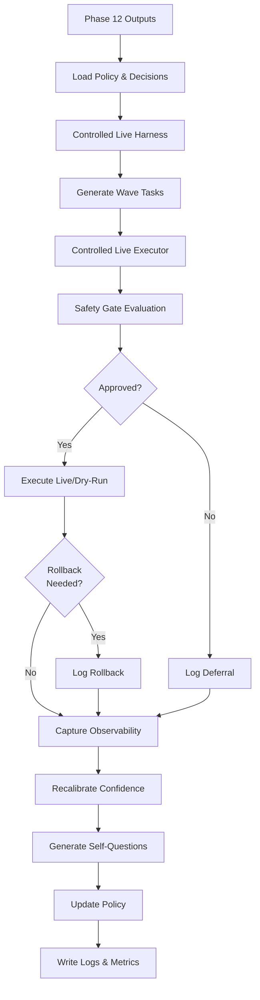

# Phase 13 Architecture — Controlled Live Environment

Generated: 2026-02-05

## Overview
Phase 13 introduces controlled live-environment simulations for low-risk web operations. The system maintains strict safety gates, automatic rollback capabilities, and full observability while executing pre-approved tasks with actual web interactions.

All Phase 1–12 logic remains untouched (additive design). Phase 13 extends the dry-run simulation framework with live action capabilities, risk-based access control, and policy-driven execution.

## Core Modules

### buddy_safety_gate.py
Enforces safety constraints for live web action execution.

**Safety Rules:**
- **LOW Risk:** Approved if confidence ≥ 0.5
- **MEDIUM Risk:** Approved if confidence ≥ 0.75 AND explicit approval granted
- **HIGH Risk:** Deferred unless confidence ≥ 0.9 AND explicitly approved
- **Dry-run Mode:** Always approved (overrides all rules)

**Key Methods:**
- `evaluate()`: Assess task for safety approval
- `approve_task()`: Grant explicit approval for specific task
- `get_decisions()`: Retrieve all safety gate decisions for wave

### buddy_controlled_live_executor.py
Executes tasks with controlled live web actions, safety evaluation, and confidence recalibration.

**Capabilities:**
- Risk-based execution eligibility
- Dry-run/live execution toggle per task
- Automatic rollback on precondition failure
- Confidence recalibration based on outcomes
- Full observability capture

**Execution Flow per Task:**
1. Safety gate evaluation (approve/defer/reject)
2. If deferred: Log deferral reason
3. If approved:
   - Execute (live or dry-run based on approval)
   - Capture execution metadata
   - Generate self-questions
   - Recalibrate confidence
   - Check rollback conditions
4. Return outcome (completed/failed/rolled_back)

### buddy_controlled_live_harness.py
Orchestrates multi-wave controlled live environment execution.

**Responsibilities:**
- Ingest Phase 12 strategic outputs (policies, decisions, confidence calibration)
- Generate appropriate test tasks per wave
- Orchestrate ControlledLiveExecutor per wave
- Update adaptive policies from live outcomes
- Produce structured logs and UI state

**Execution Modes:**
- **Controlled Live:** Live execution for approved LOW/MEDIUM tasks, dry-run for others
- **Enforce Dry-Run:** All tasks execute dry-run (for testing/validation)
- **Strict Approval:** Requires explicit approval for all non-LOW tasks
- **Permissive:** Approves MEDIUM risk tasks automatically if confidence sufficient

## Execution Flow



## Safety Gates in Detail

### Approval Status Enumeration
- **APPROVED:** Task eligible for execution (live or dry-run)
- **DEFERRED:** Task queued for later (does not execute)
- **REJECTED:** Task permanently excluded (error state)

### Risk Level Decision Matrix

| Risk Level | Min Confidence | Requires Approval | Requires Dry-Run Override | Can Execute Live |
|---|---|---|---|---|
| LOW | 0.5 | No | No | Yes |
| MEDIUM | 0.75 | Yes (if strict) | No | Yes |
| HIGH | 0.9 | Yes (always) | Yes (unless approved) | No |
| UNKNOWN | 0.7 | Yes | Yes | No |

### Approval Flow
```
Task submitted → Risk evaluation → Confidence check
  ↓ (LOW, conf ≥ 0.5)
  → APPROVED (execute live if enabled)
  
  ↓ (MEDIUM, conf ≥ 0.75)
  → Check explicit approval
    → If approved: APPROVED
    → Else: DEFERRED (await approval)
  
  ↓ (HIGH, conf ≥ 0.9)
  → Check explicit approval
    → If approved: APPROVED (dry-run enforced unless high-confidence)
    → Else: DEFERRED (defer indefinitely)
```

## Rollback Mechanisms

### Rollback Triggers
1. **Precondition Failure:** Dependencies not met or blocked
2. **Safety Gate Violation:** Runtime constraint violated
3. **Live Action Error:** Web action returned error status
4. **Timeout:** Task execution exceeded time limit

### Rollback Behavior
- Task status marked as `rolled_back`
- Confidence decreased by 0.1
- Error reason logged
- Task queued for retry in future wave with reduced confidence

## Observability Integration

### Captured per Task
- Task ID, risk level, confidence
- Approval status and reason
- Execution type (live vs dry-run)
- Success/failure status
- Execution time (milliseconds)
- Error messages if any
- Rollback state

### Structured Outputs
- **self_questions.jsonl:** Self-reflective questions per task (4 per task)
- **task_outcomes.jsonl:** Full execution outcomes with observability
- **confidence_updates.jsonl:** Pre/post confidence scores
- **policy_updates.jsonl:** Adaptive policy changes per wave
- **safety_gate_decisions.jsonl:** All safety gate evaluations
- **phase13_ui_state.json:** UI-ready state for Phase 7/8 visualization

### Wave-Level Metrics
- Total/completed/deferred/failed/rolled_back tasks
- Live vs dry-run execution split
- Success rate per wave
- Safety gate decision distribution

## Policy Adaptation

Phase 13 inherits Phase 12 final policy:
- **high_risk_threshold:** Threshold for deferring high-risk tasks (typically 0.8)
- **retry_multiplier:** Multiplier for retry attempts on failures
- **priority_bias:** Multiplicative boost for priority-weighted task ordering

Live outcome metrics trigger policy updates:
- High failure rate (>20%) → Increase retry_multiplier
- High deferral rate (>30%) → Increase high_risk_threshold
- High success rate (>85%) → Increase priority_bias

## Safety Guarantees

✓ **No unapproved live actions:** HIGH risk tasks never execute live without explicit approval  
✓ **Automatic deferral:** Tasks not meeting confidence/approval gates deferred immediately  
✓ **Rollback capability:** Failed tasks can be rolled back/retry without data corruption  
✓ **Full audit trail:** All decisions, executions, and rollbacks logged in JSONL format  
✓ **Dry-run override:** All modes support dry-run toggle for testing/validation  
✓ **Observability:** Complete metadata captured per task for debugging/review  

## Configuration Options

```python
ControlledLiveHarness(
    phase12_dir="outputs/phase12",
    output_dir="outputs/phase13",
    allow_live=True,              # Enable live execution
    require_approval=True         # Require approval for MEDIUM/HIGH
)

harness.run(
    waves=3,
    enforce_dry_run=False         # Force all tasks dry-run
)
```

## Phase 14 Readiness

Phase 13 outputs provide complete foundation for Phase 14 autonomous operation planning:
- Live execution patterns (success rates, rollback frequencies)
- Confidence calibration under live conditions
- Safety gate effectiveness metrics
- Policy adaptation trajectories
- Complete observability data for ML training

All structured outputs (JSONL + JSON) ready for Phase 14 ingestion and advanced autonomous reasoning.
