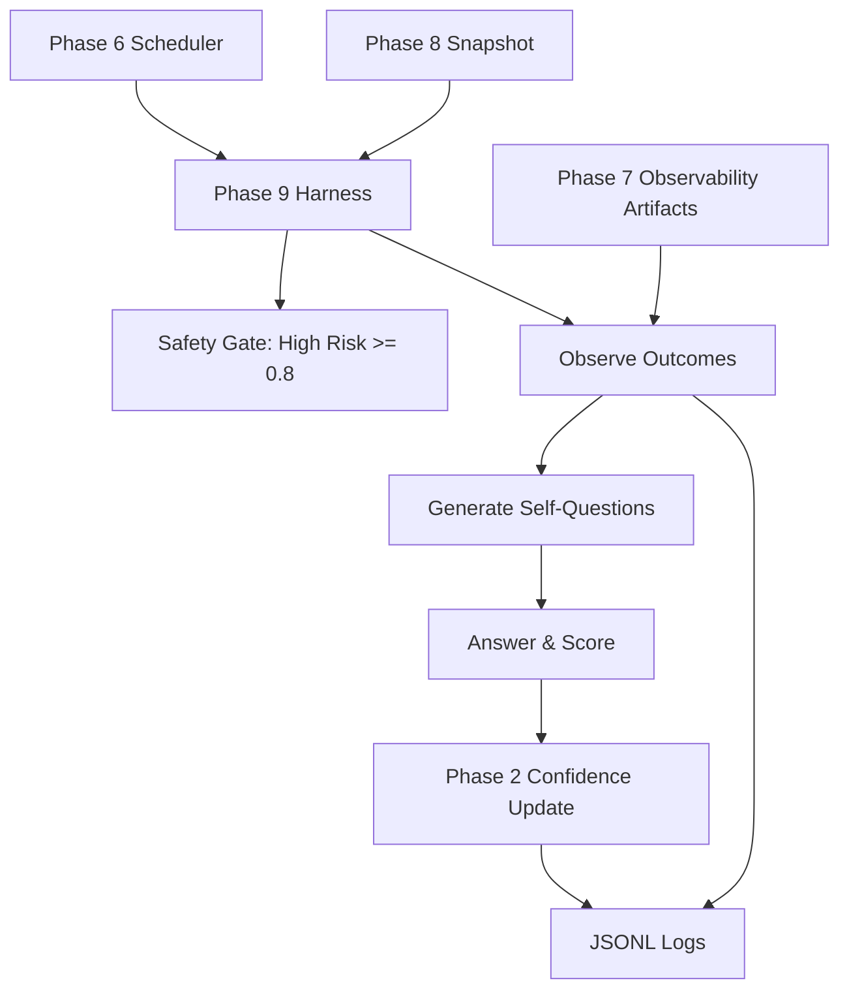

# Phase 9 Architecture — Self-Reflective Harness

Generated: 2026-02-05

## Overview
Phase 9 adds a self-reflective testing harness that safely runs Buddy workflows in a sandboxed, dry-run mode. The harness observes outcomes, asks internal self-questions, answers them using the Phase 2 confidence engine, and writes structured logs for later learning. Phase 9 is fully additive and does **not** modify any Phase 1–8 logic.

## Goals
- Autonomous dry-run workflow execution
- Self-questioning per task and per outcome
- Confidence recalibration using Phase 2 metrics
- Safety gating for high-risk tasks ($\ge 0.8$ confidence required)
- Structured JSONL logging for analysis and Phase 10–12 extensibility

## Core Modules
- buddy_self_reflective_harness.py
  - Orchestrates scheduler, safety gating, self-questions, confidence updates
  - Integrates Phase 6 scheduler and Phase 2 confidence calculator
  - Reads Phase 7 observability artifacts when available

- buddy_self_reflective_tests.py
  - Mock workflows with low/medium/high risk steps
  - Validates self-questioning, confidence updates, and safety behavior

## Execution Loop
1. Seed workflow (Phase 8 snapshot if present, otherwise fallback mock workflow)
2. Apply safety gates:
   - High-risk tasks with confidence < 0.8 are deferred
3. Start Phase 6 scheduler (dry-run enabled)
4. Observe completed/failed/deferred tasks
5. Generate self-questions per task
6. Answer questions and log responses
7. Update confidence via Phase 2 calculator
8. Log outcomes and confidence updates
9. Repeat until all tasks reach a terminal state

## Observability Inputs
When available, the harness ingests:
- outputs/task_scheduler_metrics/queue_state.json
- outputs/task_scheduler_metrics/task_execution_log.jsonl

This data is attached to each outcome record under `observability`.

## Safety Model
- No real web tools are invoked; only safe, local mock actions are registered.
- High-risk tasks are **deferred** unless confidence $\ge 0.8$.
- Dry-run is enforced even for allowed high-risk steps.
- All outputs are written to new Phase 9 log files only.

## Extensibility
Phase 9 is designed to support Phase 10–12 by:
- Modular question generation and answering
- Confidence recalibration logic isolated to a single method
- Observability snapshots captured as structured metadata
- JSONL logs for downstream analysis

## Data Outputs
- outputs/phase9/self_questions.jsonl
- outputs/phase9/task_outcomes.jsonl
- outputs/phase9/confidence_updates.jsonl
- PHASE_9_SELF_REFLECTIVE_REPORT.md

## Architecture Diagram (Mermaid)

## Reasoning Loop Example
- Task: "High risk submit" (risk=HIGH, confidence=0.6)
- Safety Gate: deferred, logged as `deferred`
- Self-questions:
  - Did the task complete successfully? → no
  - Were dependencies satisfied? → yes
  - Was the risk level respected? → yes
  - Is confidence aligned with outcome? → misaligned
- Confidence update: reduced score, flagged for review
